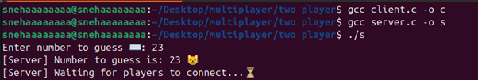
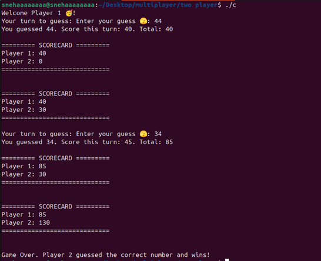
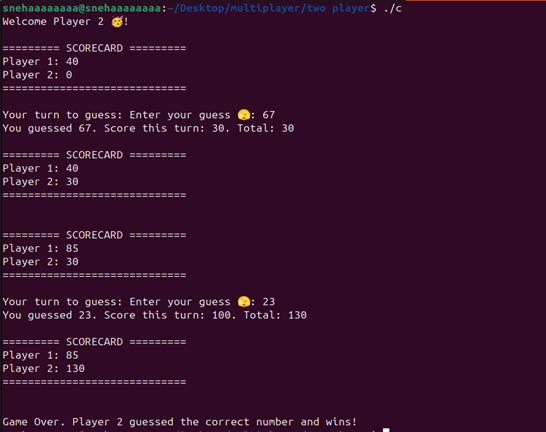

# OS Project: Client-Server Communication using Sockets in C

## 📌 Project Overview
This project demonstrates inter-process communication in C using sockets over a TCP/IP network, showcasing client-server architecture. It was built as part of an Operating Systems course to practically implement IPC concepts.

The project allows:
- A server to listen for client connections
- A client to connect to the server and exchange messages
- Basic message passing between client and server via terminal

## 🧠 Key Concepts Used
- Socket programming (TCP)
- Inter-process communication (IPC)
- File descriptors and system calls
- I/O multiplexing using select()
- Network byte order functions

## 🗂️ Project Structure
```
├── server.c    # Server-side code that handles incoming client connections
├── client.c    # Client-side code that connects to the server
└── README.md   # Project documentation
```

## 🛠️ Building the Project

### Prerequisites
- GCC compiler
- Git (for cloning)
- Unix-like environment (Linux/macOS) or Windows with WSL/MinGW

### Getting the Code
1. Clone the repository:
```bash
git clone https://github.com/yourusername/socket-number-game.git
```

2. Navigate to the project directory:
```bash
cd socket-number-game
```

### Compilation Steps

1. Compile the server:
```bash
gcc server.c -o server
```

2. Compile the client:
```bash
gcc client.c -o client
```

### Troubleshooting Common Build Issues
- If you get permission errors when running executables, use:
  ```bash
  chmod +x server client
  ```
- For Windows users with MinGW:
  ```bash
  gcc -o server.exe server.c -lws2_32
  gcc -o client.exe client.c -lws2_32
  ```
- If you encounter socket-related errors, make sure your firewall isn't blocking the connection

### Development Setup
- For VS Code users:
  1. Install C/C++ extension
  2. Set up your compiler path
  3. Configure launch.json for debugging

## 🚀 Running the Application

### Step 1: Start the Server
```bash
./server
```
The server will start and listen on a specified port (check server.c for the exact port).

### Step 2: Run the Client(s)
In a new terminal window:
```bash
./client
```
You can run multiple clients (in different terminals) to simulate multiple connections if supported.

## 📸 Screenshots




When none of the players has guessed the correct number:


### Server Initialization
[Add screenshot of server starting up]

### Client Connection
[Add screenshot of client connecting to server]

### Message Exchange
[Add screenshot of message exchange between client and server]

### Multiple Clients (if applicable)
[Add screenshot of multiple clients connected]

## ✨ Features
- Server can handle incoming client connections
- Basic text messaging between client and server
- Clean separation of concerns between client and server logic
- May include select() for handling multiple clients

## 🎮 Game Mechanics & Score Calculation

### Game Flow
1. The server generates a random number that players need to guess
2. Multiple clients (players) can connect to the server
3. Players take turns making guesses
4. The game continues until a player correctly guesses the number

### Scoring System
- Each player starts with 0 points
- Points are awarded based on:
  - Correct guess: +10 points
  - Close guess (within ±5 of target): +5 points
  - Far guess: 0 points
- First player to guess correctly gets bonus points
- Game can be played in multiple rounds

### Game Scenarios
1. **Successful Guess**
   - Player guesses the exact number
   - Points are awarded
   - Round ends
   
2. **Close Guess**
   - Player's guess is within range
   - Partial points awarded
   - Game continues
   
3. **Failed Attempts**
   - When no player guesses correctly
   - Game continues until correct guess
   - Server provides hints after certain attempts

### Example Round
```
Server: Generated number is 42
Player 1: Guesses 45 → Gets 5 points (close guess)
Player 2: Guesses 20 → Gets 0 points (far guess)
Player 1: Guesses 42 → Gets 10 points + bonus (correct guess)
Round Ends
```

## 📦 Dependencies
- Standard C Libraries
- Works on Linux/Unix systems
- No external dependencies

## ⚙️ Future Improvements
- Add multi-client support using fork() or select()
- Implement user authentication
- Add GUI interface using ncurses or a web socket layer
- File transfer or chat history feature

## 🤝 Contributing
1. Fork the repository
2. Create your feature branch
3. Commit your changes
4. Push to the branch
5. Create a new Pull Request

